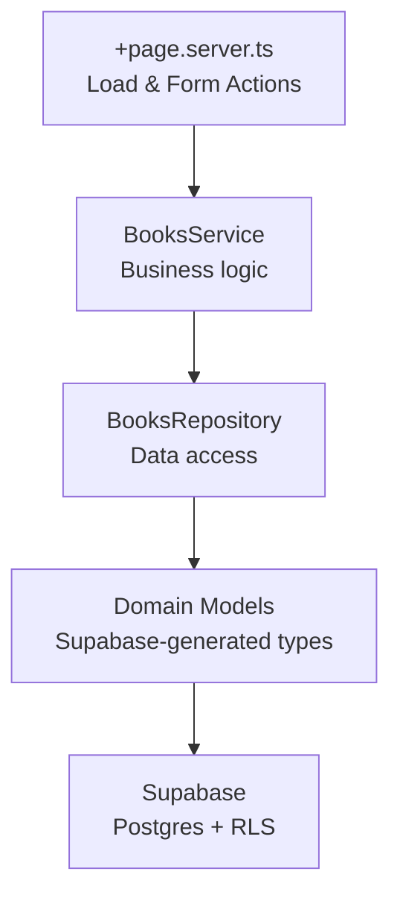
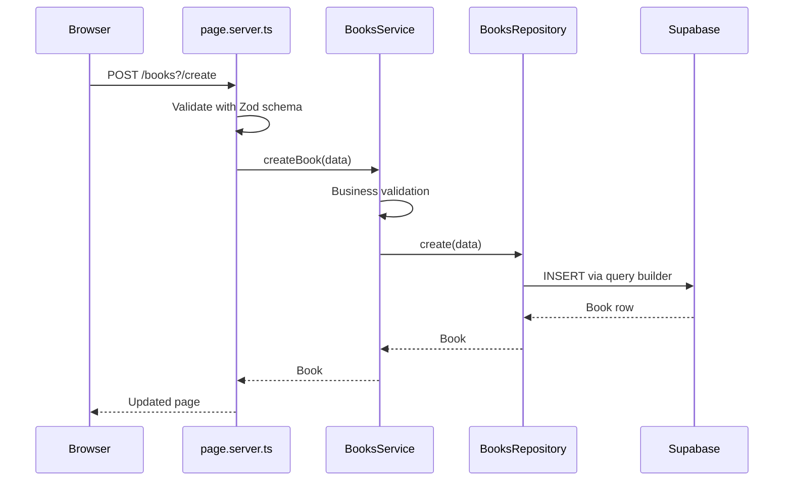
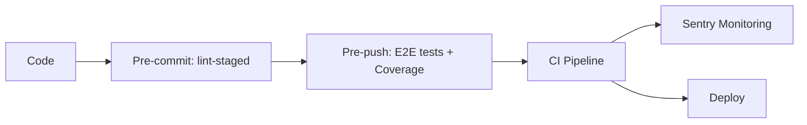

# Svelte Raw Template

A production-ready SvelteKit starter template built with shift-left quality practices. Catch bugs early, ship with confidence.

## Philosophy

This template embraces the **shift-left** methodology—integrating quality gates at every stage of development rather than catching issues in production. Every commit is linted, every push is tested, and every merge is validated through CI/CD.

**Fail fast, fix early.**

## Project Structure

```
├── 📁 .claude
│   ├── 📁 rules
│   │   ├── 📝 clean-architecture.md
│   │   ├── 📝 coding-conventions.md
│   │   ├── 📝 svelte-standards.md
│   │   └── 📝 typescript-standards.md
│   ├── 📁 skills
│   │   └── 📁 plan-feature
│   │       └── 📝 SKILL.md
│   └── ⚙️ settings.json
├── 📁 .github
│   └── 📁 workflows
│       └── ⚙️ main.yml
├── 📁 .husky
│   ├── 📄 pre-commit
│   └── 📄 pre-push
├── 📁 e2e
├── 📁 src
│   ├── 📁 lib
│   │   ├── 📁 alerts
│   │   │   └── 📄 toast.ts
│   │   ├── 📁 components
│   │   │   └── 📁 ui
│   │   │       ├── 📁 button
│   │   │       ├── 📁 card
│   │   │       ├── 📁 form-field
│   │   │       ├── 📁 input
│   │   │       ├── 📁 label
│   │   │       └── 📁 pagination
│   │   ├── 📁 data
│   │   ├── 📁 domain
│   │   │   ├── 📁 models
│   │   │   │   └── 📄 book.ts
│   │   │   └── 📁 types
│   │   │       └── 📄 database.types.ts
│   │   ├── 📁 schemas
│   │   │   └── 📄 book.schema.ts
│   │   ├── 📁 server
│   │   │   ├── 📁 repositories
│   │   │   │   └── 📄 books.repository.ts
│   │   │   ├── 📁 services
│   │   │   │   └── 📄 books.service.ts
│   │   │   └── 📄 auth.ts
│   │   ├── 📄 axios.ts
│   │   ├── 📄 env.ts
│   │   └── 📄 utils.ts
│   ├── 📁 routes
│   │   ├── 📁 books
│   │   │   ├── 📁 components
│   │   │   │   ├── 📄 BookCreateForm.svelte
│   │   │   │   ├── 📄 BookEmptyState.svelte
│   │   │   │   ├── 📄 BookFormError.svelte
│   │   │   │   ├── 📄 BookList.svelte
│   │   │   │   └── 📄 BookListItem.svelte
│   │   │   ├── 📄 +page.server.ts
│   │   │   ├── 📄 +page.svelte
│   │   │   └── 📄 booksPage.svelte.ts
│   │   ├── 📁 protected
│   │   │   ├── 📄 +page.server.ts
│   │   │   └── 📄 +page.svelte
│   │   ├── 📄 +layout.js
│   │   ├── 📄 +layout.svelte
│   │   └── 📄 +page.svelte
│   ├── 🎨 app.css
│   ├── 📄 app.d.ts
│   ├── 🌐 app.html
│   ├── 📄 hooks.client.ts
│   └── 📄 hooks.server.ts
├── 📁 supabase
│   └── 📁 migrations
│       └── 📄 20260316114311_create_books_table.sql
├── 📁 static
│   └── 🖼️ favicon.svg
├── ⚙️ .editorconfig
├── ⚙️ .env.dist
├── ⚙️ .gitignore
├── ⚙️ .npmrc
├── ⚙️ .prettierignore
├── ⚙️ .prettierrc
├── 📝 CLAUDE.md
├── 📝 README.md
├── ⚙️ components.json
├── 📄 eslint.config.js
├── ⚙️ package.json
├── 📄 playwright.config.ts
├── 📄 playwright.monocart-reporter.ts
├── ⚙️ pnpm-lock.yaml
├── 📄 svelte.config.js
├── ⚙️ tsconfig.json
└── 📄 vite.config.ts
```

## Supabase Architecture

This template uses **Supabase** (Postgres + Row Level Security) as its backend, wired through a **clean architecture** pattern with strict layer boundaries.

### Layered Architecture



| Layer | Location | Responsibility |
|-------|----------|----------------|
| **Domain** | `src/lib/domain/` | Type definitions derived from Supabase-generated `database.types.ts` |
| **Schemas** | `src/lib/schemas/` | Zod validation schemas for form input |
| **Repository** | `src/lib/server/repositories/` | Data access — wraps Supabase query builder |
| **Service** | `src/lib/server/services/` | Business logic and orchestration |
| **Route** | `src/routes/` | SvelteKit load functions and form actions |

### Dependency Injection via Hooks

All dependencies are instantiated **per-request** in `hooks.server.ts` and injected through `event.locals`:

```
hooks.server.ts
  └─ createServerClient()          → event.locals.supabase
     └─ new BooksRepository(supabase)  → event.locals.booksRepository
        └─ new BooksService(repository)  → event.locals.booksService
```

Route handlers access services directly from `locals` — no manual wiring needed:

```ts
// +page.server.ts
export const load: PageServerLoad = async ({ locals }) => {
  const books = await locals.booksRepository.getAll();
  return { books };
};
```

### Request Flow (Example: Create a Book)



### Database Migrations

SQL migrations live in `supabase/migrations/` and include **Row Level Security** policies:

```sql
CREATE TABLE IF NOT EXISTS public.books (
  id UUID PRIMARY KEY DEFAULT gen_random_uuid(),
  title TEXT NOT NULL,
  author TEXT NOT NULL,
  created_at TIMESTAMPTZ NOT NULL DEFAULT now()
);

ALTER TABLE public.books ENABLE ROW LEVEL SECURITY;
```

### Adding a New Entity

To add a new Supabase-backed entity (e.g., `authors`), follow this checklist:

1. **Migration** — Create a SQL migration in `supabase/migrations/` with the table and RLS policies
2. **Types** — Regenerate `database.types.ts` with `supabase gen types typescript`
3. **Domain model** — Add types in `src/lib/domain/models/` derived from the generated types
4. **Schema** — Add Zod schemas in `src/lib/schemas/` for form validation
5. **Repository** — Add a repository class in `src/lib/server/repositories/`
6. **Service** — Add a service class in `src/lib/server/services/`
7. **Hooks** — Wire repository and service into `event.locals` in `hooks.server.ts`
8. **Type declaration** — Update `App.Locals` in `src/app.d.ts`
9. **Route** — Create the SvelteKit route with load function, actions, and components

### Path Aliases

| Alias | Path | Purpose |
|-------|------|---------|
| `$domain/*` | `src/lib/domain/*` | Types and domain models |
| `$schemas/*` | `src/lib/schemas/*` | Zod validation schemas |
| `$server/*` | `src/lib/server/*` | Repositories, services, auth |
| `$components/*` | `src/lib/components/*` | Reusable UI components |

## AI-Assisted Development (`.claude/`)

This project includes a `.claude/` configuration folder that enables **engineering-grade AI assistance** via [Claude Code](https://docs.anthropic.com/en/docs/claude-code). It encodes the project's coding standards, architectural patterns, and workflows so the AI follows the same rules a senior engineer would.

### What It Provides

- **Scoped rules** — Coding conventions activate only on relevant file types (e.g., Svelte standards apply to `*.svelte` files, TypeScript standards to `*.ts` files), so the AI always follows the right patterns in the right context.
- **Custom skills** — Reusable prompts for common workflows (e.g., `plan-feature` generates an engineering checklist before writing code).
- **Post-edit hooks** — Automated ESLint runs after every file edit, catching issues immediately.
- **Project instructions (`CLAUDE.md`)** — A top-level file that gives the AI full context on the architecture, libraries, and quality pipeline.

### `.claude/` Structure

```
.claude/
  rules/
    coding-conventions.md   # Brace style, no inline returns
    svelte-standards.md     # Svelte 5 Runes, SvelteKit patterns, SOLID
    typescript-standards.md # satisfies, type guards, strict rules
  skills/
    plan-feature/
      SKILL.md              # Engineering checklist workflow
  settings.json             # Post-edit hooks, tool permissions
```

### How to Use

1. Install [Claude Code](https://docs.anthropic.com/en/docs/claude-code)
2. Open the project — Claude Code automatically reads `CLAUDE.md` and `.claude/`
3. Ask it to build features, fix bugs, or refactor — it will follow the project's standards

## Quality Gates



| Stage | Trigger | Actions |
|-------|---------|---------|
| Pre-commit | `git commit` | Prettier + ESLint on staged files |
| Pre-push | `git push` | Full Playwright E2E test suite with coverage |
| CI/CD | Push/PR to main | Lint, type-check, test, build |
| Runtime | Production | Sentry error tracking & performance monitoring |

## Technologies

**Core**
- SvelteKit
- TypeScript
- Vite

**Backend**
- Supabase (Postgres, Row Level Security, SSR auth)

**Styling**
- Tailwind CSS v4
- Bits UI
- Tailwind Merge & Variants

**Quality**
- ESLint & Prettier
- Playwright (E2E)
- Monocart Reporter (V8 Code Coverage)
- Husky (Git hooks)
- lint-staged

**Observability**
- Sentry (Error tracking & Performance monitoring)

**Validation**
- Zod
- Superforms

**HTTP**
- Axios

## Getting Started

Install dependencies:

```bash
pnpm install
```

Start the development server:

```bash
pnpm dev
```

Build for production:

```bash
pnpm build
```

Preview the production build:

```bash
pnpm preview
```

## Commands

| Command | Description |
|---------|-------------|
| `pnpm dev` | Start development server |
| `pnpm build` | Build for production |
| `pnpm preview` | Preview production build |
| `pnpm check` | Run type checks |
| `pnpm lint` | Lint and check formatting |
| `pnpm format` | Format code with Prettier |
| `pnpm test` | Run E2E tests |
| `pnpm test:show-report` | Open Monocart test report |
| `pnpm coverage:show-report` | Open V8 coverage report |

## Code Coverage

E2E tests collect V8 code coverage using Playwright's built-in coverage API and Monocart Reporter.

**Report Formats**
- V8 HTML Report: `./coverage/e2e/v8/index.html`
- LCOV: `./coverage/e2e/lcov/code-coverage.lcov.info`
- Cobertura XML: `./coverage/e2e/cobertura/code-coverage.cobertura.xml`

## Environment Variables

Copy `.env.dist` to `.env` and fill in the values:

```
# Supabase
PUBLIC_SUPABASE_URL=your-supabase-project-url
PUBLIC_SUPABASE_ANON_KEY=your-supabase-anon-key

# API
VITE_API_BASE_URL=your-base-api

# Sentry
VITE_SENTRY_DSN=your-sentry-dsn
SENTRY_DSN=your-sentry-dsn
SENTRY_ORG=your-sentry-org
SENTRY_PROJECT=your-sentry-project
SENTRY_AUTH_TOKEN=your-sentry-auth-token
```

## CI/CD Pipeline

GitHub Actions workflow triggers on push and pull requests to main:

1. Install dependencies (pnpm)
2. Run linter and formatter checks
3. Run TypeScript type checks
4. Install Playwright browsers
5. Execute E2E test suite
6. Build the application
