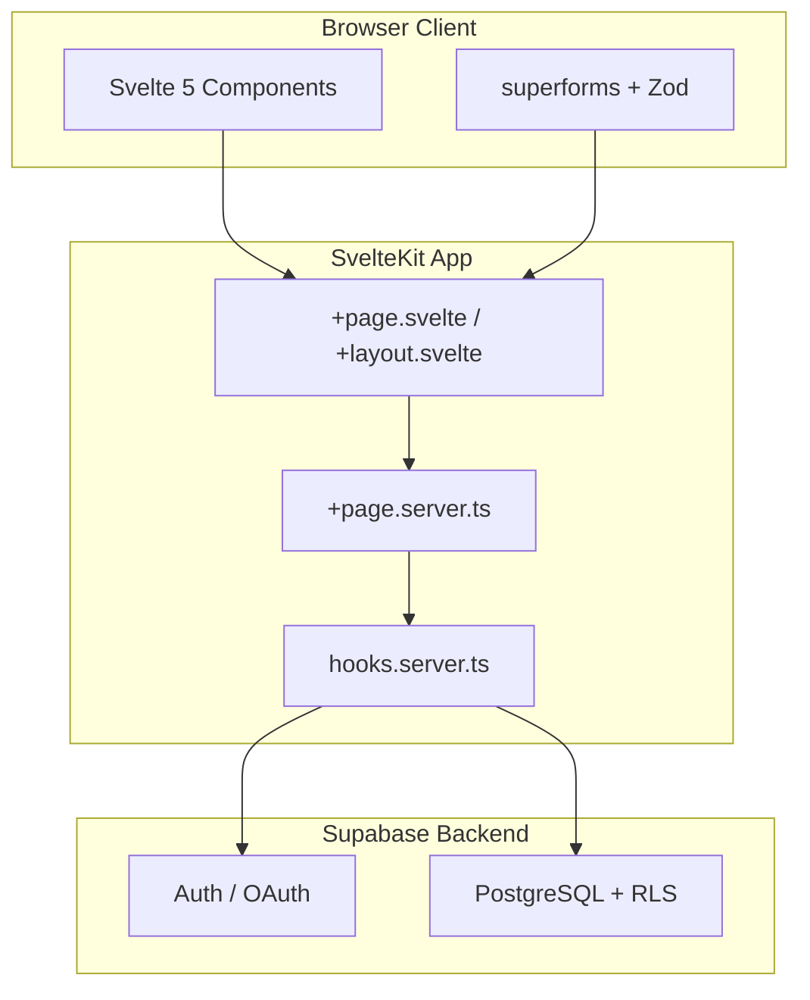
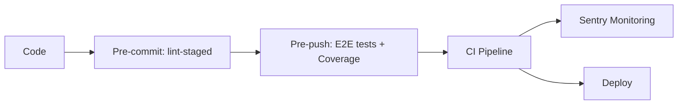

# Svelte Supabase Starter Template

A production-ready SvelteKit starter template with Supabase backend, following clean architecture and shift-left quality practices. Catch bugs early, ship with confidence.

## Philosophy

This template embraces the **shift-left** methodology — integrating quality gates at every stage of development rather than catching issues in production. Every commit is linted, every push is tested, and every merge is validated through CI/CD.

**Fail fast, fix early.**

## Architecture Overview



See [Architecture Overview](./01_ARCHITECTURE.md) for detailed diagrams and patterns.

## Main Scripts

| Script                          | Description                                    |
| ------------------------------- | ---------------------------------------------- |
| `pnpm dev`                      | Start development server with Vite             |
| `pnpm build`                    | Build production bundle                        |
| `pnpm preview`                  | Preview production build locally               |
| `pnpm check`                    | Run TypeScript type checking                   |
| `pnpm check:watch`              | Run type checking in watch mode                |
| `pnpm format`                   | Format code with Prettier                      |
| `pnpm lint`                     | Run Prettier check + ESLint                    |
| `pnpm test`                     | Run Playwright E2E tests                       |
| `pnpm test:show-report`         | Open Monocart HTML test report                 |
| `pnpm coverage:show-report`     | Open V8 coverage HTML report                   |
| `pnpm supabase:gen-types`       | Generate TypeScript types from remote Supabase |
| `pnpm supabase:gen-types:local` | Generate TypeScript types from local Supabase  |
| `pnpm prepare`                  | Install Husky git hooks                        |

## Documentation

| Document                                             | Description                                            |
| ---------------------------------------------------- | ------------------------------------------------------ |
| [Architecture Overview](./01_ARCHITECTURE.md)        | Detailed architecture and design patterns              |
| [Svelte Standards](./02_SVELTE-STANDARDS.md)         | Svelte 5 patterns, SOLID principles, and form handling |
| [Routing & Pages](./03_ROUTING-PAGES.md)             | File-based routing and page patterns                   |
| [Supabase Guide](./04_SUPABASE-GUIDE.md)             | Database integration and clean architecture layers     |
| [Testing Guide](./05_TESTING.md)                     | E2E testing with Playwright and V8 coverage            |
| [UI Components](./06_UI-COMPONENTS.md)               | Component architecture and styling system              |
| [TypeScript Standards](./07_TYPESCRIPT-STANDARDS.md) | TypeScript conventions and coding rules                |

## Path Aliases

| Alias           | Path                   | Purpose                                |
| --------------- | ---------------------- | -------------------------------------- |
| `$lib`          | `src/lib`              | Base library alias (SvelteKit default) |
| `$components/*` | `src/lib/components/*` | Reusable UI components                 |
| `$schemas/*`    | `src/lib/schemas/*`    | Zod validation schemas                 |
| `$domain/*`     | `src/lib/domain/*`     | Types, models, mappers                 |
| `$server/*`     | `src/lib/server/*`     | Repositories, services, auth           |

## Technology Stack

### Core

- SvelteKit 2 — Full-stack framework with file-based routing
- Svelte 5 — Component framework using Runes API (`$state`, `$derived`, `$effect`)
- TypeScript — Strict mode with bundler module resolution
- Vite — Build tool and dev server

### Backend

- Supabase — Postgres database with Row Level Security
- @supabase/ssr — SSR-compatible Supabase client
- Axios — HTTP client for external API calls

### UI & Styling

- Tailwind CSS v4 — Utility-first CSS framework with Vite plugin
- Bits UI — Headless component primitives
- Tailwind Variants — Component variant composition
- Tailwind Merge — Class conflict resolution (`cn()`)
- Lucide Svelte — Icon library

### Forms & Validation

- Zod v4 — Schema validation
- sveltekit-superforms — Form state management with Zod integration

### Quality & Testing

- ESLint — Code linting with TypeScript, Svelte, and Prettier compatibility
- Prettier — Code formatting with import sorting and Tailwind class sorting
- Playwright — End-to-end testing with V8 code coverage
- Monocart Reporter — Coverage reporting (HTML, LCOV, Cobertura)
- Husky — Git hooks (pre-commit, pre-push)
- lint-staged — Staged file linting

### Observability

- Sentry — Error tracking, performance monitoring, and session replay

## Quality Gates



| Stage      | Trigger         | Actions                                        |
| ---------- | --------------- | ---------------------------------------------- |
| Pre-commit | `git commit`    | Prettier + ESLint on staged files              |
| Pre-push   | `git push`      | Full Playwright E2E test suite with coverage   |
| CI/CD      | Push/PR to main | Lint, type-check, test, build                  |
| Runtime    | Production      | Sentry error tracking & performance monitoring |

## AI-Assisted Development (`.claude/`)

This project includes a `.claude/` configuration folder that enables **engineering-grade AI assistance** via [Claude Code](https://docs.anthropic.com/en/docs/claude-code). It encodes the project's coding standards, architectural patterns, and workflows so the AI follows the same rules a senior engineer would.

### What It Provides

- **Scoped rules** — Coding conventions activate only on relevant file types (e.g., Svelte standards apply to `*.svelte` files, TypeScript standards to `*.ts` files)
- **Custom skills** — Reusable prompts for common workflows (e.g., `plan-feature` generates an engineering checklist before writing code)
- **Post-edit hooks** — Automated ESLint runs after every file edit, catching issues immediately
- **Project instructions (`CLAUDE.md`)** — A top-level file that gives the AI full context on the architecture, libraries, and quality pipeline

### How to Use

1. Install [Claude Code](https://docs.anthropic.com/en/docs/claude-code)
2. Open the project — Claude Code automatically reads `CLAUDE.md` and `.claude/`
3. Ask it to build features, fix bugs, or refactor — it will follow the project's standards

## Getting Started

Install dependencies:

```bash
pnpm install
```

Start the development server:

```bash
pnpm dev
```

Build for production:

```bash
pnpm build
```

Preview the production build:

```bash
pnpm preview
```

## Code Coverage

E2E tests collect V8 code coverage using Playwright's built-in coverage API and Monocart Reporter.

**Report Formats**

| Format        | Path                                                   |
| ------------- | ------------------------------------------------------ |
| V8 HTML       | `./coverage/e2e/v8/index.html`                         |
| Monocart HTML | `./coverage/e2e/monocart-report.html`                  |
| LCOV          | `./coverage/e2e/lcov/code-coverage.lcov.info`          |
| Cobertura XML | `./coverage/e2e/cobertura/code-coverage.cobertura.xml` |

## Environment Variables

Copy `.env.dist` to `.env` and fill in the values:

```
# Supabase
PUBLIC_SUPABASE_URL=your-supabase-project-url
PUBLIC_SUPABASE_ANON_KEY=your-supabase-anon-key

# API
VITE_API_BASE_URL=your-base-api

# Sentry
VITE_SENTRY_DSN=your-sentry-dsn
SENTRY_DSN=your-sentry-dsn
SENTRY_ORG=your-sentry-org
SENTRY_PROJECT=your-sentry-project
SENTRY_AUTH_TOKEN=your-sentry-auth-token
```

## CI/CD Pipeline

GitHub Actions workflow triggers on push and pull requests to main:

1. Install dependencies (pnpm)
2. Run linter and formatter checks
3. Run TypeScript type checks
4. Install Playwright browsers
5. Execute E2E test suite
6. Build the application
