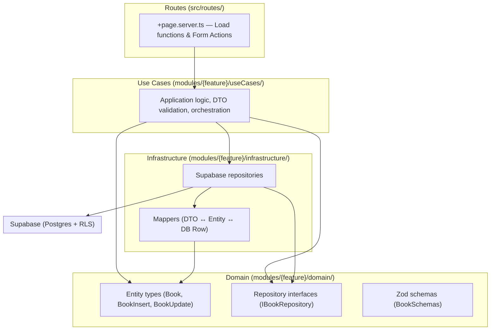
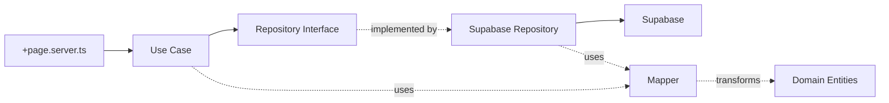
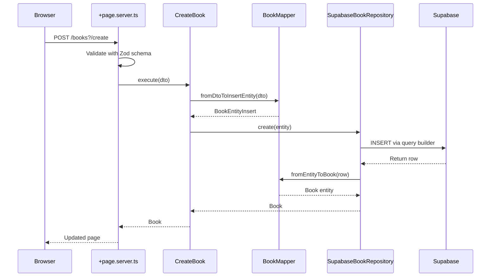

# Architecture Overview

## Module-Based Clean Architecture

The project uses a **module-based clean architecture** where each feature lives in its own module under `src/lib/modules/`. Each module is organized into three layers:

```
src/lib/modules/
├── books/
│   ├── domain/           # Entities, repository interfaces, Zod schemas
│   ├── useCases/         # Application logic (CreateBook, GetAllBooks, etc.)
│   └── infrastructure/   # Supabase repositories, mappers
└── shared/
    ├── domain/           # Cross-cutting types (database types)
    └── infrastructure/   # Cross-cutting infrastructure (auth)
```

### Layered Architecture



### Layer Responsibilities

| Layer              | Location                            | Responsibility                                           |
| ------------------ | ----------------------------------- | -------------------------------------------------------- |
| **Domain**         | `modules/{feature}/domain/`         | Entity types, repository interfaces, Zod schemas         |
| **Use Cases**      | `modules/{feature}/useCases/`       | Application logic, orchestrates repositories and mappers |
| **Infrastructure** | `modules/{feature}/infrastructure/` | Supabase repositories, mappers, external integrations    |
| **Shared Domain**  | `modules/shared/domain/`            | Cross-cutting types (database types)                     |
| **Shared Infra**   | `modules/shared/infrastructure/`    | Cross-cutting infrastructure (auth)                      |
| **Route**          | `src/routes/`                       | SvelteKit load functions and form actions                |
| **Components**     | `src/lib/components/ui/`            | Reusable UI primitives (shadcn-svelte pattern)           |

### Dependency Flow



**Rules:**

- Use Cases NEVER import `@supabase/supabase-js` or `@supabase/ssr`
- Repositories are the ONLY layer allowed to call Supabase methods
- Repository interfaces live in `domain/` — concrete implementations in `infrastructure/`
- Mappers are the ONLY place where DB row types and domain entity types coexist
- Routes NEVER instantiate clients, repositories, or use cases directly

## Dependency Injection

The Supabase client is created **per-request** in `hooks.server.ts` and attached to `event.locals`. Repositories and use cases are instantiated where needed (typically in `+page.server.ts`), receiving the Supabase client via constructor:

```
hooks.server.ts
  └─ createServerClient() → event.locals.supabase

+page.server.ts
  └─ new SupabaseBookRepository(locals.supabase)
      └─ new CreateBook(repository)
```

Route handlers instantiate use cases with the repository:

```ts
// +page.server.ts
export const load: PageServerLoad = async ({ locals }) => {
  const repository = new SupabaseBookRepository(locals.supabase);
  const getAllBooks = new GetAllBooks(repository);
  const books = await getAllBooks.execute();
  return { books };
};
```

## Request Flow Example: Create a Book



## Page Decomposition Pattern

Every page follows a three-layer decomposition. See [Routing & Pages](./03_ROUTING-PAGES.md#page-component-pattern) for the full pattern with code examples.
