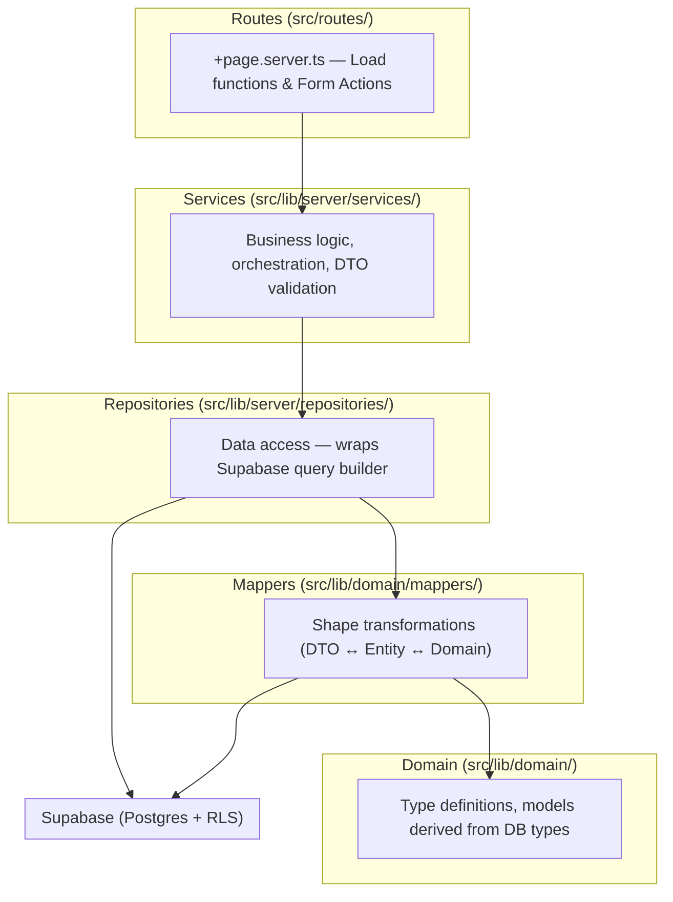
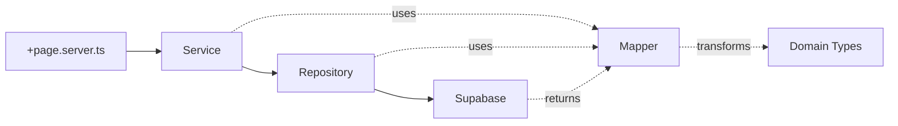
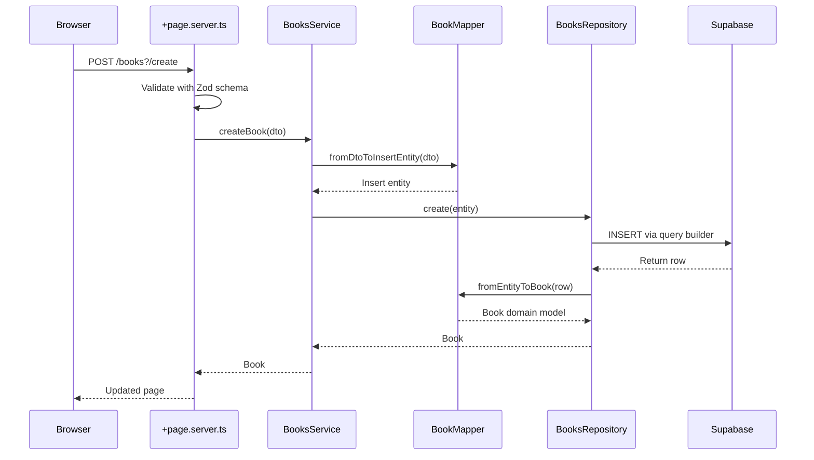

# Architecture Overview

### Layered Architecture



### Layer Responsibilities

| Layer          | Location                       | Responsibility                                                |
| -------------- | ------------------------------ | ------------------------------------------------------------- |
| **Domain**     | `src/lib/domain/`              | Type definitions, models, mappers — no framework dependencies |
| **Schemas**    | `src/lib/schemas/`             | Zod validation schemas for form input                         |
| **Repository** | `src/lib/server/repositories/` | Data access — ONLY layer that touches SupabaseClient          |
| **Service**    | `src/lib/server/services/`     | Business logic and orchestration                              |
| **Route**      | `src/routes/`                  | SvelteKit load functions and form actions                     |
| **Components** | `src/lib/components/ui/`       | Reusable UI primitives (shadcn-svelte pattern)                |

### Dependency Flow



**Rules:**

- Services NEVER import `@supabase/supabase-js` or `@supabase/ssr`
- Repositories are the ONLY layer allowed to call Supabase methods
- Mappers are the ONLY place where DB row types and domain model types coexist
- Routes NEVER instantiate clients, repositories, or services directly

## Dependency Injection

All dependencies are instantiated **per-request** in `hooks.server.ts` and injected through `event.locals`:

```
hooks.server.ts
  └─ createServerClient()          → event.locals.supabase
      └─ new BooksRepository(supabase)  → event.locals.booksRepository
          └─ new BooksService(repository)  → event.locals.booksService
```

Route handlers access services directly from `locals`:

```ts
// +page.server.ts
export const load: PageServerLoad = async ({ locals }) => {
  const books = await locals.booksRepository.getAll();
  return { books };
};
```

## Request Flow Example: Create a Book



## Page Decomposition Pattern

Every page follows a three-layer decomposition. See [Routing & Pages](./03_ROUTING-PAGES.md#page-component-pattern) for the full pattern with code examples.
