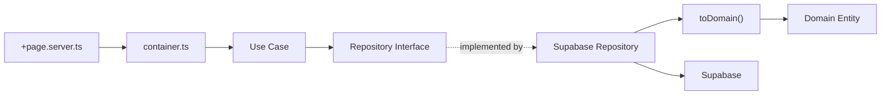
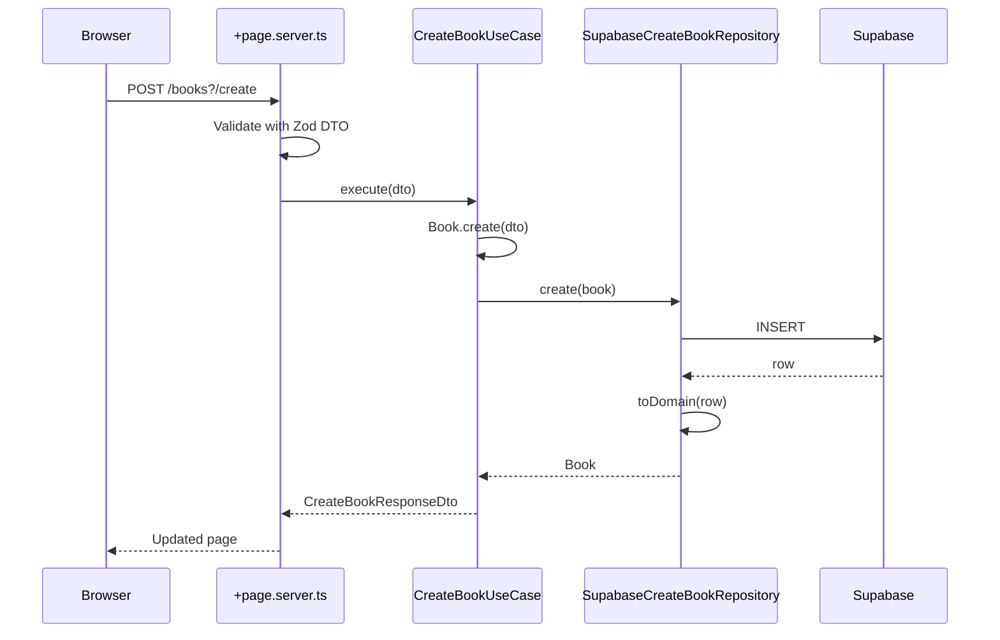

# Architecture Overview

## Clean Architecture Layers

```
src/
├── domain/                        # Pure business logic, zero framework deps
│   └── entities/
│       ├── book.entity.ts         # Domain entity (Book class)
│       ├── errors.ts             # Domain errors (BookNotFoundError, etc.)
│       ├── oauth-provider.enum.ts # OAuth providers enum
│       └── auth-schemas.ts        # Auth-related Zod schemas
│
├── application/                   # Application logic, use cases
│   └── use-cases/
│       └── books/
│           ├── create-book/
│           │   ├── create-book.use-case.ts
│           │   ├── create-book.repository.interface.ts
│           │   ├── create-book.request.dto.ts
│           │   └── create-book.response.dto.ts
│           └── update-book/
│               ├── update-book.use-case.ts
│               ├── update-book.repository.interface.ts
│               └── update-book.request.dto.ts
│       └── auth/
│           ├── sign-in-with-magic-link/
│           └── sign-in-with-oauth/
│
├── infrastructure/                # External concerns (DB, APIs)
│   └── database/
│       └── postgres/
│           ├── entities/         # DB row type aliases
│           │   └── book.entity.ts
│           └── repositories/     # Repository implementations
│               ├── books/
│               │   ├── supabase-create-book.repository.ts
│               │   └── supabase-update-book.repository.ts
│               └── auth/
│                   └── supabase-auth.repository.ts
│
└── lib/
    ├── containers/               # DI wiring (connects use cases to repos)
    │   ├── books.container.ts
    │   └── auth.container.ts
    ├── shared/
    │   ├── domain/
    │   │   └── database.types.ts # Supabase generated types
    │   └── infrastructure/
    │       ├── auth.server.ts     # User authentication helper
    │       └── supabase-storage.repository.ts
    └── components/                # UI components
```

## Layer Responsibilities

| Layer              | Location                   | Responsibility                                          |
| ------------------ | -------------------------- | ------------------------------------------------------- |
| **Domain**         | `domain/entities/`         | Entity classes with business rules, no framework deps   |
| **Application**    | `application/use-cases/`   | Application logic, one class per use case               |
| **Infrastructure** | `infrastructure/database/` | Supabase repos with `toDomain` mappers, DB entity types |
| **Container**      | `lib/containers/`          | Wires use cases with concrete repositories              |
| **Route**          | `src/routes/`              | SvelteKit load functions and form actions               |

## Dependency Rules

- Domain has **zero** external imports — no Supabase, no SvelteKit
- Use Cases depend on repository **interfaces**, never concrete implementations
- Repository interfaces live in `application/use-cases/{use-case}/` alongside the use case
- Infrastructure depends on Domain (for entity classes) and `lib/shared/domain/` (for DB types)
- Routes import only the container function — never repositories or use cases directly



## Dependency Injection

The Supabase client is created per-request in `hooks.server.ts` and passed to the container in `+page.server.ts`:

```ts
// +page.server.ts
import { createBooksContainer } from '$lib/containers/books.container';

const { create } = createBooksContainer(locals.supabase);
await create.execute(dto);
```

The container wires everything:

```ts
// lib/containers/books.container.ts
export function createBooksContainer(supabase: SupabaseClient<Database>) {
  return {
    create: new CreateBookUseCase(new SupabaseCreateBookRepository(supabase)),
    update: new UpdateBookUseCase(new SupabaseUpdateBookRepository(supabase))
  };
}
```

## Request Flow: Create a Book


